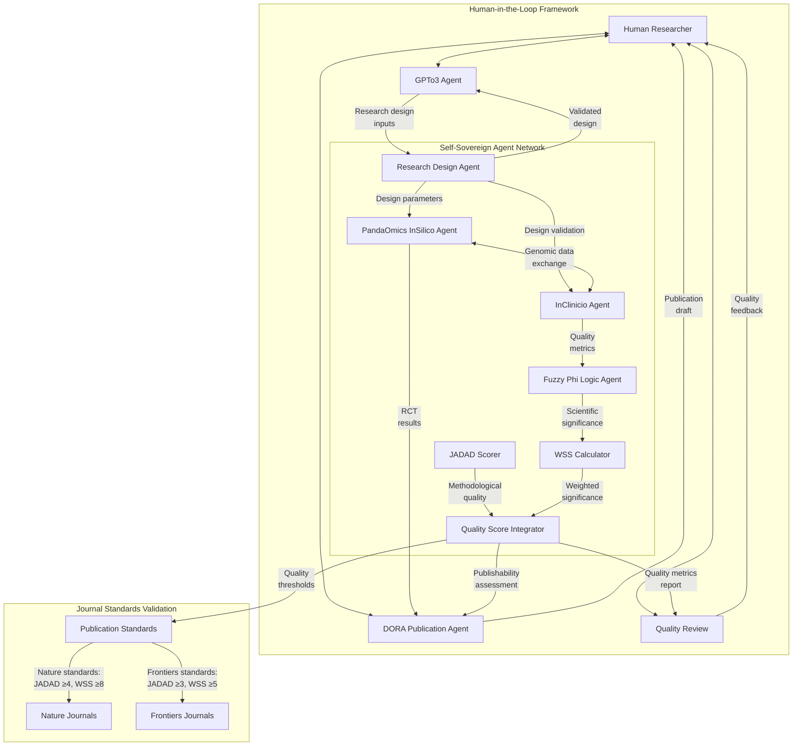
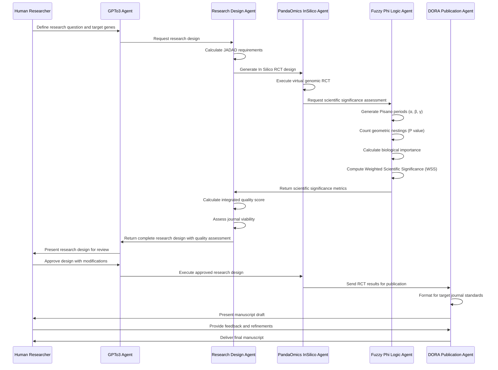

## Overview: Human-in-the-Loop Agentic AGI Network

The Universal Mind Research Pipeline represents a groundbreaking innovation in scientific research design and publication. This system employs a network of self-sovereign AI agents working synergistically with human researchers in a human-in-the-loop framework to ensure the highest quality genomic research that meets publication standards for prestigious journals.

## Core Principles

- **Human-AI Symbiosis**: Human researchers guide the system while AI agents automate complex analysis
- **Self-Sovereign Agent Network**: Independent, specialized agents with clearly defined responsibilities
- **Quality-Driven Research**: Rigorous standards via JADAD scoring and Fuzzy Phi Logic
- **Interdisciplinary Integration**: Bridging genomics, mathematics, and publication standards

## Agent Network Architecture



## Genomic RCT Vector Grading System

The Universal Mind pipeline implements a sophisticated grading system for genomic Randomized Controlled Trials, combining JADAD scoring for methodological rigor with Impact Factor analysis and Fuzzy Phi Logic for scientific significance.

### JADAD Scoring Criteria

|JADAD Component|Scoring|Requirement|
|---|---|---|
|Randomization|0-2 points|+1 for mentioning randomization<br>+1 for appropriate randomization method<br>-1 for inappropriate method|
|Blinding|0-2 points|+1 for mentioning double-blinding<br>+1 for appropriate blinding method<br>-1 for inappropriate method|
|Withdrawals|0-1 point|+1 for describing withdrawals with reasons|
|**Total Score**|**0-5 points**|**≥4 for Nature, ≥3 for Frontiers**|

### Impact Factor (IF) Assessment

|IF Range|Journal Tier|Example Journals|Required JADAD|
|---|---|---|---|
|>20|Tier 1|Nature, Science, Cell|≥4|
|10-19.9|Tier 2|Nature Methods, Genome Biology|≥4|
|5-9.9|Tier 3|Frontiers journals, Bioinformatics|≥3|
|<5|Tier 4|Field-specific journals|≥3|

### Fuzzy Phi Logic Assessment

The Fuzzy Phi Logic system evaluates scientific significance by analyzing the relationship between genomic research and fundamental mathematical and biological patterns.

#### Research Vector Calculation:

```
Scientific Significance = P × WSS

Where:
- P = Number of Platonic Geometries nested in the transcribed circle of Pisano Period
- WSS = Weighted Scientific Significance based on biological importance
```

#### WSS Categories:

|WSS Range|Category|Description|Examples|
|---|---|---|---|
|8-10|High|Creates cellular life|Chlorophyll creation, biosynthesis, cellular duplication, DNA transcription, gene expression|
|5-7|Medium|Supports cellular life|Molecular docking, protein folding, quantum coherence, quantum tunneling|
|1-4|Low|Creates elemental life|Electron/proton/neutron spin, rotation, orbit|

## Human-in-the-Loop Integration Points

The system maintains human oversight and guidance at critical decision points:

1. **Research Design Initiation**: Humans define research questions and target genes
2. **Design Review**: Humans review and approve agent-generated research designs
3. **Quality Assessment Oversight**: Humans can override or adjust quality scores
4. **Publication Review**: Humans review and refine AI-generated manuscripts
5. **Journal Selection**: Humans make final decisions on target journals

## Quality-Driven Publication Workflow



## Publication Requirements Matrix

The system automatically evaluates and ensures research meets publication requirements based on integrated quality metrics:

|Journal|JADAD Score|WSS Category|Integrated Quality Score|Additional Requirements|
|---|---|---|---|---|
|Nature|≥4|High (≥8)|≥7|Sample size >200, multi-omics validation|
|Science|≥4|High (≥8)|≥7|Novel findings, cross-disciplinary relevance|
|Cell|≥4|High (≥8)|≥7|Mechanistic insights, therapeutic implications|
|Nature Methods|≥4|Medium/High (≥7)|≥6.5|Novel methodology, benchmarking|
|Genome Biology|≥4|Medium/High (≥7)|≥6.5|Data availability, reproducibility|
|Frontiers|≥3|Medium (≥5)|≥5|Open science practices, rigorous methods|

## Case Study: BRCA1/TP53/EGFR in Breast Cancer

This example demonstrates how the Universal Mind pipeline evaluates a genomic study of BRCA1, TP53, and EGFR in breast cancer:

1. **Research Design**: Triple-blind RCT with computer-generated randomization
2. **JADAD Score**: 5/5 (optimal methodological quality)
3. **Pisano Period Analysis**:
    - Modulus: 5 (based on gene interactions)
    - Geometric nestings: 4 (triangular, square, pentagonal, octahedral)
4. **Biological Importance**: 0.92 (high relationship to cellular processes)
5. **Weighted Scientific Significance**: 9.2 (high category)
6. **Integrated Quality Score**: 8.1
7. **Publication Viability**: Meets Nature standards (JADAD ≥4, WSS ≥8)
8. **Target Journal**: Nature Methods (IF: 28.5)

## Conclusion

The Universal Mind Research Pipeline represents a pioneering approach to scientific research, leveraging a network of self-sovereign AI agents with human-in-the-loop guidance to ensure the highest quality genomic research. By integrating JADAD scoring and Fuzzy Phi Logic, the system provides a comprehensive quality assessment framework that ensures research meets the stringent standards of high-impact journals while allowing for frontier innovation in genomic science.